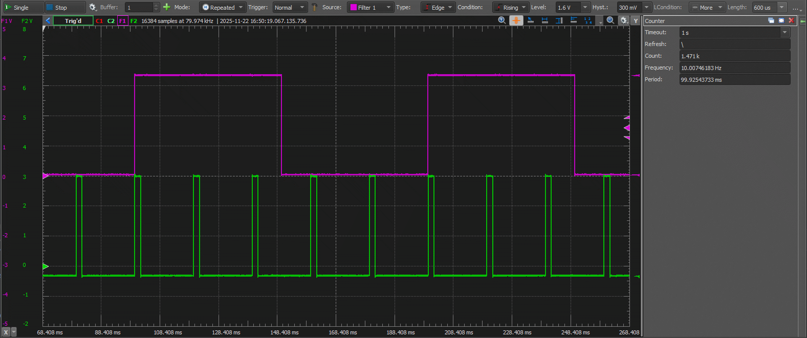

[](https://crates.io/crates/spwm)
[](https://docs.rs/spwm)
[](https://codecov.io/gh/vpetrigo/spwm)

# SPWM - Software PWM for Embedded Systems

------------------------------------------

A `no_std` Rust library for generating software-based Pulse Width Modulation (PWM) signals on microcontrollers and
embedded systems. This crate provides a flexible, interrupt-driven PWM implementation that doesn't require dedicated
hardware PWM peripherals.

## Features

- **`no_std` compatible** - Works in embedded environments without the standard library
- **Multiple independent channels** - Configure up to N channels (compile-time constant)
- **Thread-safe** - Uses atomic operations for safe access from interrupt contexts
- **Type-safe builder pattern** - Compile-time guarantees for proper channel configuration
- **Flexible callbacks** - Register callbacks for state changes and period completion
- **Dynamic updates** - Change frequency and duty cycle at runtime

## Basic Usage

Add this to your `Cargo.toml`:

```toml
[dependencies]
soft-pwm = "0.1"
```

### Creating a Simple PWM Channel

```rust
use spwm::{Spwm, SpwmState};
// Create SPWM manager with hardware timer frequency of 100 kHz
// and space for 4 channels
let mut spwm = Spwm::<4>::new(100_000);
// Create a channel with 1 kHz frequency and 50% duty cycle
let channel = spwm
    .create_channel()
    .freq_hz(1_000)
    .duty_cycle(50)
    .on_off_callback(|state: &SpwmState| {
        match state {
            SpwmState::On => {
                // Turn your output pin HIGH
            }
            SpwmState::Off => {
                // Turn your output pin LOW
            }
        }
    })
    .period_callback(|| {
        // Called at the end of each PWM period
    })
    .build()?;
let channel_id = spwm.register_channel(channel)?;

// Enable the channel to start PWM generation
spwm.get_channel(channel_id).unwrap().enable()?;
```

### In Your Timer Interrupt Handler

```rust
#[interrupt]
fn TIMER_IRQ() {
    spwm.irq_handler();
}
```

## Requirements

- Hardware timer that can interrupt at a consistent frequency
- Timer frequency must be at least 100x the desired PWM channel frequency to achieve 1% duty cycle resolution
  capabilities
- Callbacks must be short and non-blocking (they run in interrupt context)

## Example

- [STM32 Nucleo-F302R8 board example](https://github.com/vp-supplementary/nucleo-f302-spwm): 4-channel software PWM
  output

That example configures 4 channels:

- PC9: 10 Hz, 50% duty cycle
- PC8: 50 Hz, 10% duty cycle
- PC6: 500 Hz, 50% duty cycle
- PC5: 250 Hz, 64% duty cycle

Oscillogram that shows PC9 and PC8 output waveforms:



Simple LED PWM control example:

```rust
use spwm::{Spwm, SpwmState};

static mut LED_STATE: bool = false;

fn led_callback(state: &SpwmState) {
    LED_STATE = matches!(state, SpwmState::On);
    // Update your LED pin based on LED_STATE
}

let mut pwm = Spwm::<1>::new(100_000);
let channel = pwm
    .create_channel()
    .freq_hz(100) // 100 Hz PWM frequency
    .duty_cycle(25) // 25% brightness
    .on_off_callback(led_callback)
    .period_callback(|| {})
    .build()?;

let id = pwm.register_channel(channel)?;
pwm.get_channel(id).unwrap().enable()?;
```

## License

<sup>
Licensed under either of <a href="LICENSE-APACHE">Apache License, Version 2.0</a> or
<a href="LICENSE-MIT">MIT license</a> at your option.
</sup>

<br>

<sub>
Unless you explicitly state otherwise, any contribution intentionally submitted
for inclusion in this codebase by you, as defined in the Apache-2.0 license,
shall be dual licensed as above, without any additional terms or conditions.
</sub>